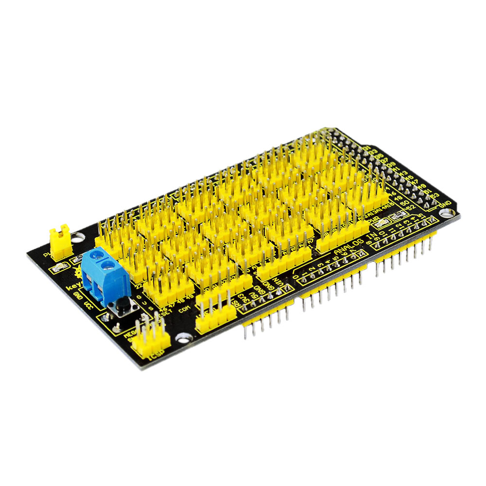
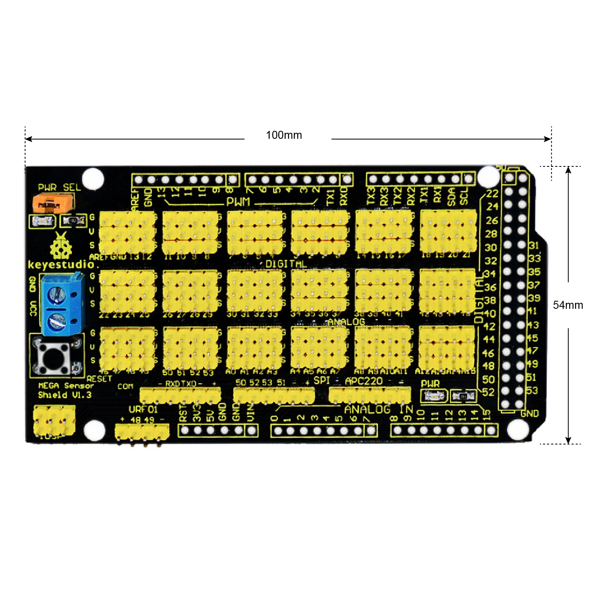
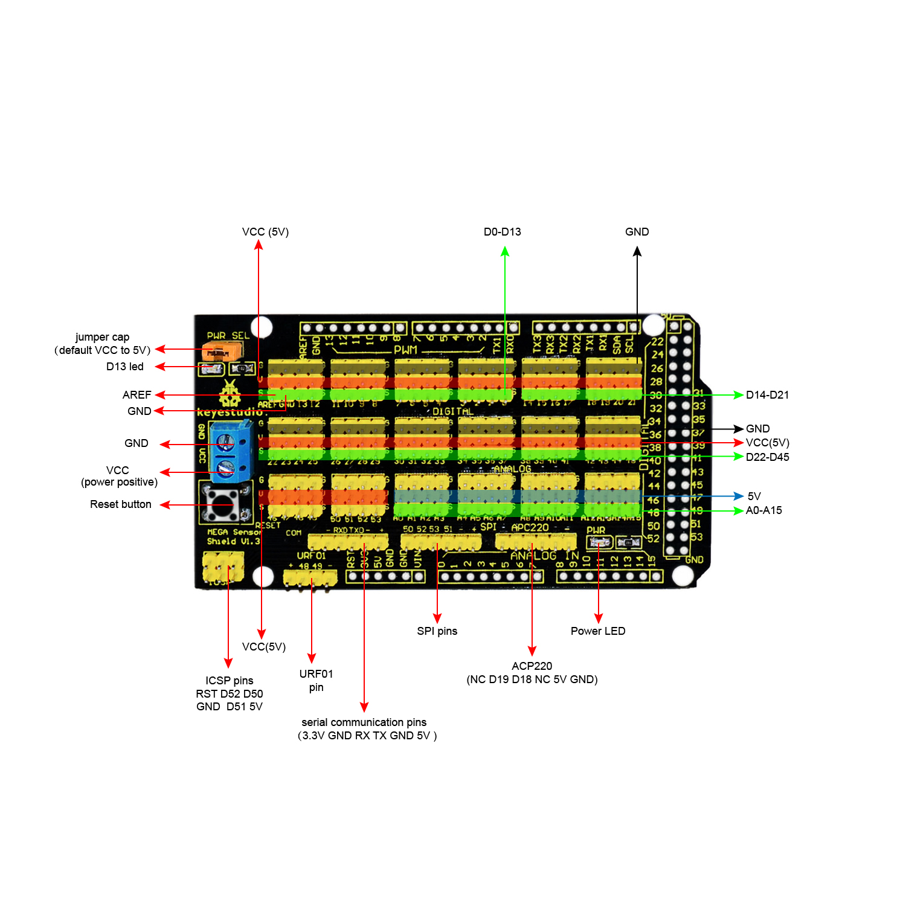
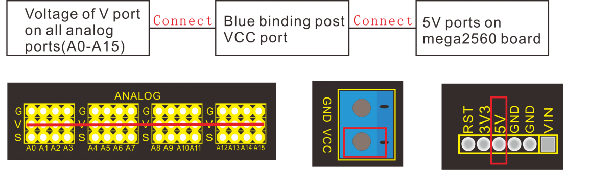
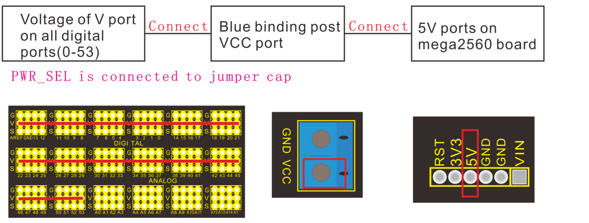
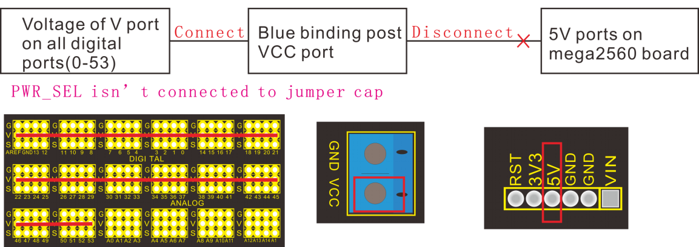
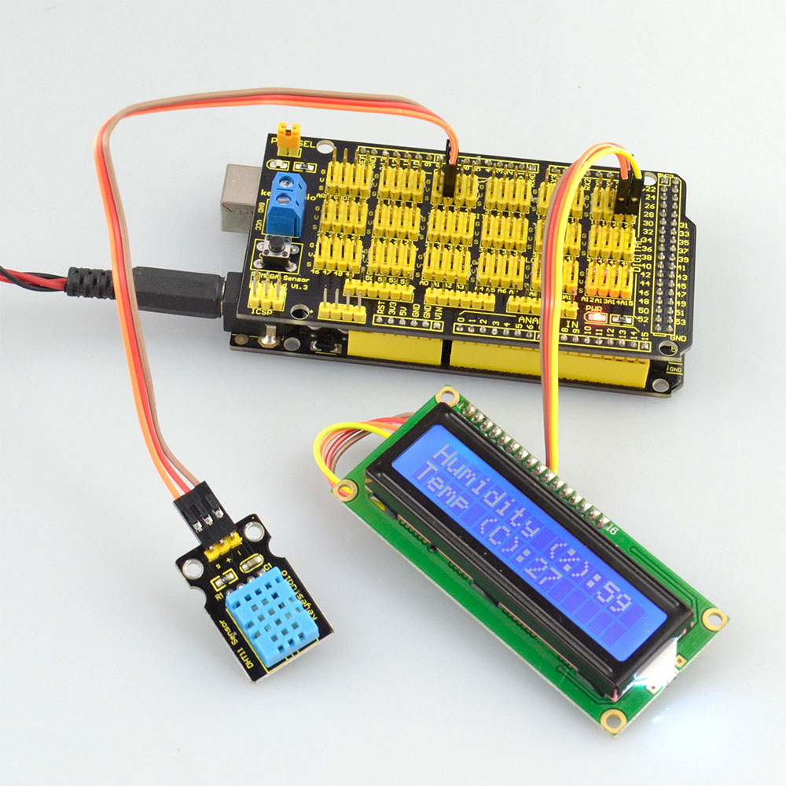

# **KS0006 Keyestudio MEGA Sensor Shield V1**

****

**Introduction:**

Have you met with these troubles? when connecting a couple of sensor modules to
MEGA control board, sometimes power output interfaces are not enough, so need to
use the breadboard and the wiring is rather troublesome.

Now don’t worry about that. You can use this keyestudio MEGA sensor shield.

It is fully compatible with MEGA control board, so that you can easily stack the
MEGA sensor shield onto the MEGA control board.

The shield comes with digital and analog interfaces in 3PIN (G V S), easy to
connect the 3PIN sensor modules. Besides, it comes with communication pins of
2.54mm pin pitch, such as serial and SPI communication.

It comes with a reset button and 2 signal indicators as well.

Note: for the 3PIN interface, the voltage of Analog pins (labeled V) is 5V;
while the voltage of Digital pins (labeled V) is VCC, that is, the voltage input
via a blue terminal block, default by jumper connected, connecting the voltage
to 5V on the shield.

**Features:**

-   Can be plugged into the MEGA control board

-   Comes with a Reset button

-   Comes with a power led and a D13 indicator

-   Extends the digital and analog interface of MEGA into 3PIN

-   Comes with a serial communication interface

-   Extends an ICSP interface

-   Extends a SPI interface

-   Extends a URF01 interface

-   Extends an APC220 interface

-   Able to supply the voltage to sensor modules via the terminal block (jumper
    cap off)

**Controllers Compatible:**

-   [keyestudio MEGA
    R3](http://wiki.keyestudio.com/index.php/Ks0002_keyestudio_Mega_2560_R3_Development_Board)

**Technical Details:**

-   Dimensions: 100mm x 54mm

-   Weight (only MEGA sensor shield): 39.2g

**PINOUT Instructions:**

****

**Example Use:**

You can stack the MEGA sensor
shield onto MEGA control board. Use the LCD, sensor module and jumper wires to
build the circuit experiment. Like below.
