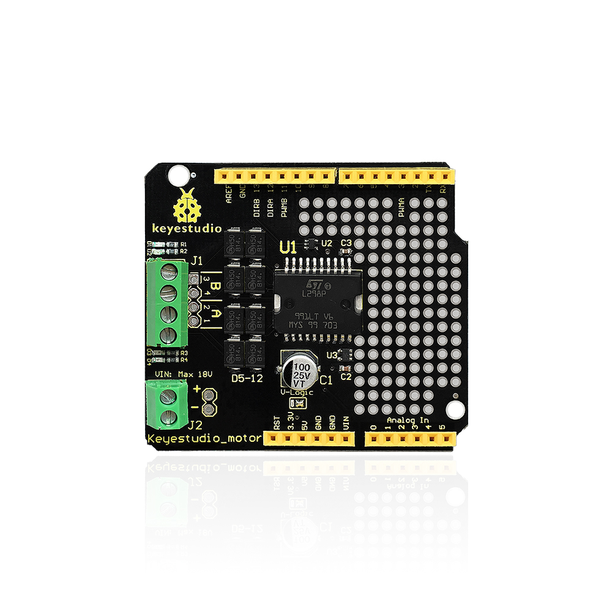
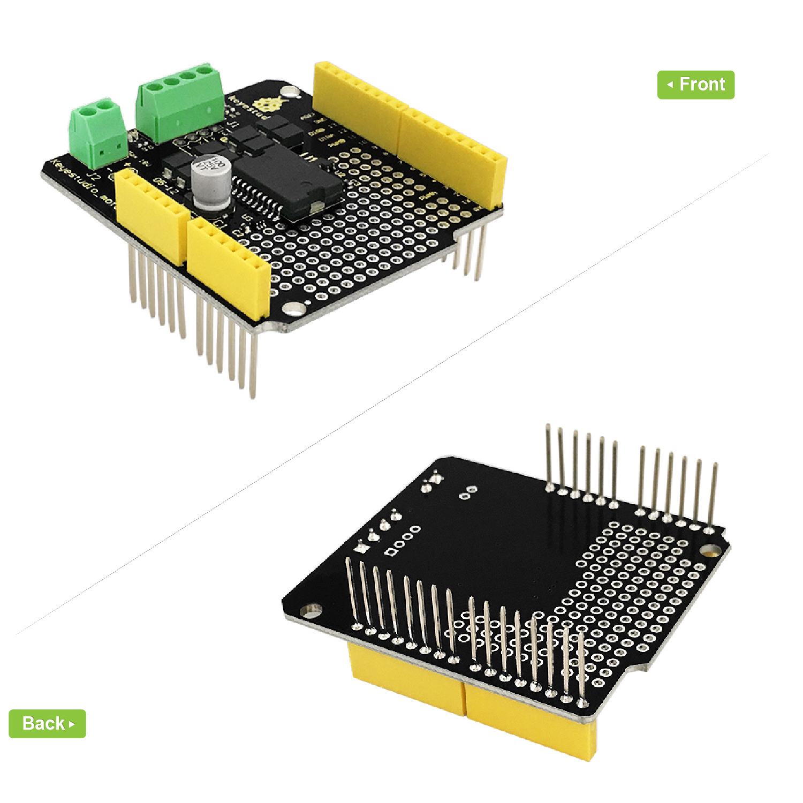
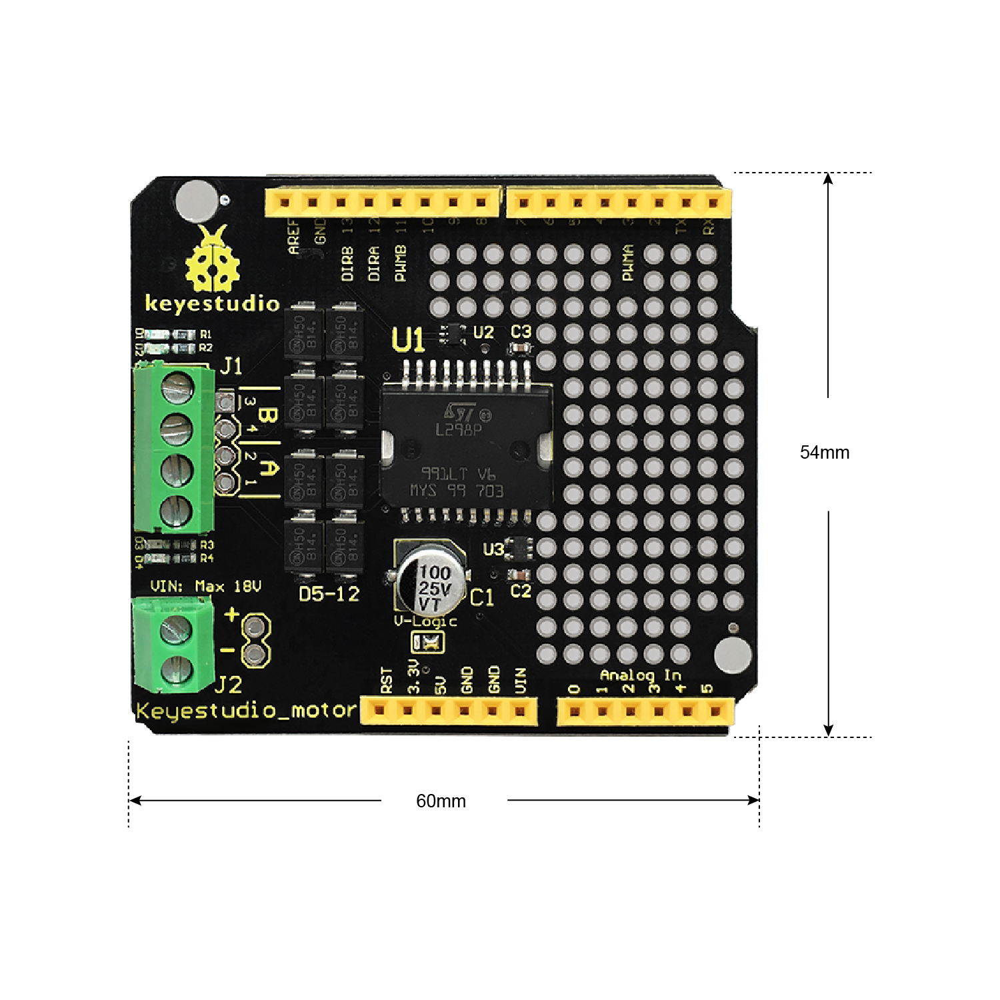
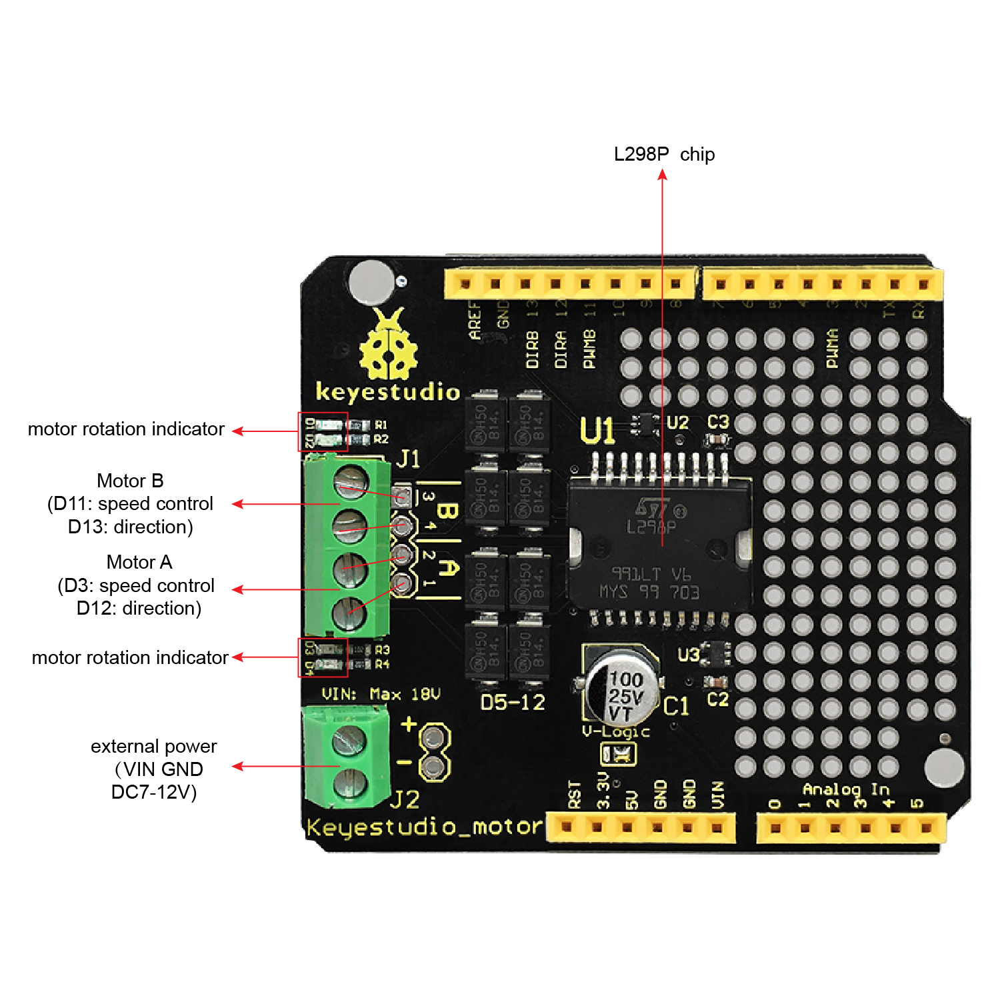
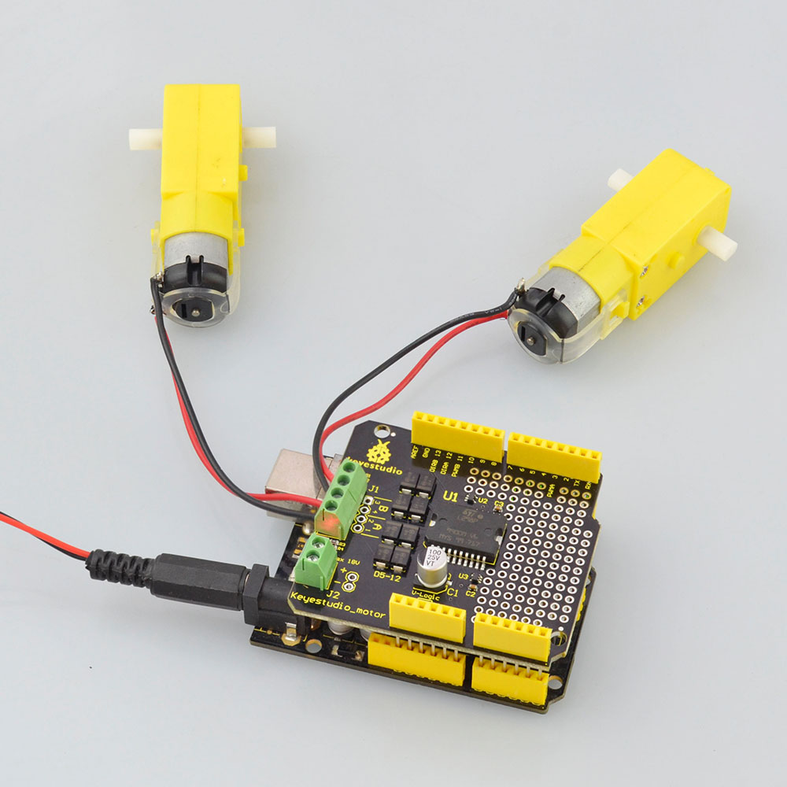

# **KS0007 Keyestudio L298P Motor Shield**

**Introduction:**

You can use UNO R3 microcontroller and add external components to complete a
variety of amazing experiments, such as smart robot DIY. When DIY your robot, it
is necessary to use the motor driver board to drive the DC motors, however,
sometimes need to connect the motor drive board to UNO using lots of jumper
wires, pretty inconvenient.

Now, we have launched this keyestudio motor shield with L298P as core. Just
simply stack it onto UNO R3 board when using. Note that the motor’s speed and
direction interfaces have been connected. D3 is for controlling the speed of
motor A, and D12 is for controlling the direction of motor A. D11 is for
controlling the speed of motor B, and D13 is for controlling the direction.

The green terminal blocks should been connected to VIN /GND pins on the UNO. You
can supply the power to the board via the terminal blocks or black DC jack of
UNO. The maximum voltage supply is DC 18V.

Onboard also comes with through-hole pad, so you are able to weld the electronic
elements to design a variety of prototyping circuits.

**Parameters:**

-   Logic part input voltage VD: 5V

-   Driving part input voltage VS: Max DC 18V (DC 7-12V recommended)

-   Logic part working current Iss: ≤36mA

-   Driving part working current Io: ≤ 2A

-   Maximum dissipation power: 25W (T=75℃)

-   Control signal input level:

-   High level: 2.3V ≤ Vin ≤ 5V

-   Low level: 0V ≤ Vin ≤ 1.5V

-   Working temperature: -25℃～＋130℃

-   Driver form: Dual power H bridge driving

**Controller Compatible:**

-   [keyestudio UNO R3
    BOARD](http://wiki.keyestudio.com/index.php/Ks0001_keyestudio_UNO_R3_BOARD)

**Technical Details:**

-   Dimensions: 60mm x 54mm

-   Weight: 20.8g

****

**PINOUT Instruction:**

**How to Test it ?**

**Connect it Up:**

Simply stack the shield onto UNO R3 board, then connect two motors to terminal
block.

**Upload the Code:**

Below is an example code, you can copy and paste it on [Arduino
IDE](http://wiki.keyestudio.com/index.php/Download_Arduino_IDE).

-   [Download Arduino
    IDE](http://wiki.keyestudio.com/index.php/How_to_Download_Arduino_IDE)

-   [Install Arduino
    Driver](http://wiki.keyestudio.com/index.php/How_to_Install_Arduino_Driver)

\*\*\*\*\*\*\*\*\*\*\*\*\*\*\*\*\*\*\*\*\*\*\*\*\*\*\*\*\*\*\*\*\*\*\*\*\*\*\*\*\*\*\*\*\*\*\*\*\*\*

int E1 = 3;

int M1 = 12;

int E2 =11;

int M2 = 13;

void setup()

{

pinMode(M1, OUTPUT);

pinMode(M2, OUTPUT);

}

void loop()

{

digitalWrite(M1,HIGH);

digitalWrite(M2, HIGH);

analogWrite(E1, 200); // PWM regulate speed

analogWrite(E2, 200); // PWM regulate speed

delay(8000);

digitalWrite(M1,LOW);

digitalWrite(M2, LOW);

analogWrite(E1, 200); //PWM regulate speed

analogWrite(E2, 200); //PWM regulate speed

delay(8000);

}

\*\*\*\*\*\*\*\*\*\*\*\*\*\*\*\*\*\*\*\*\*\*\*\*\*\*\*\*\*\*\*\*\*\*\*\*\*\*\*\*\*\*\*\*\*\*\*\*\*\*

**Test Result:**

Upload well the code, you should see the two motors firstly turn forward for 8
seconds, then reverse for 8 seconds, repeatedly.

