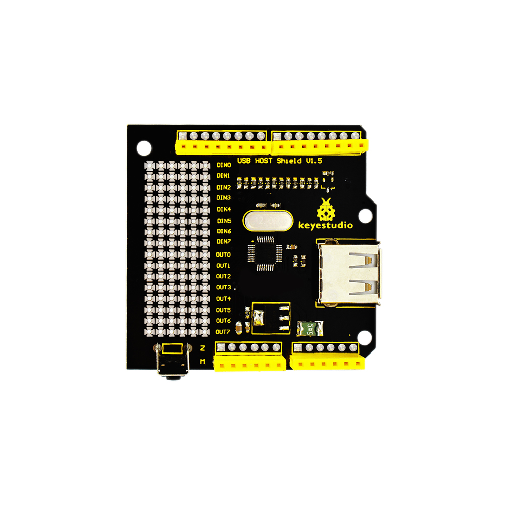
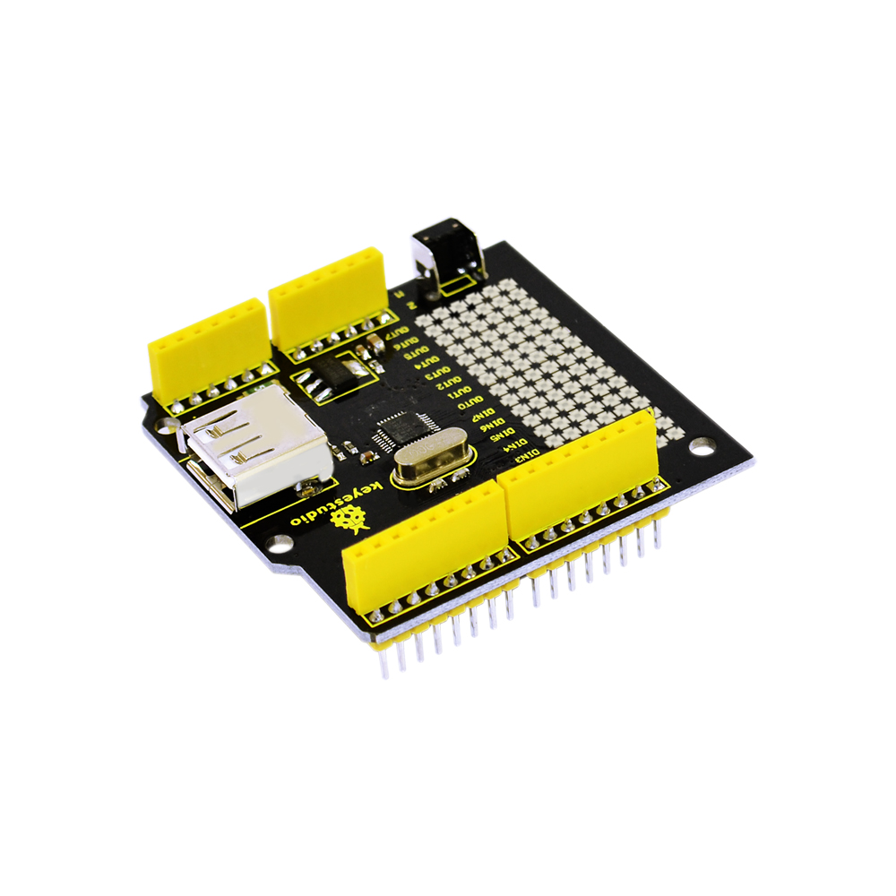
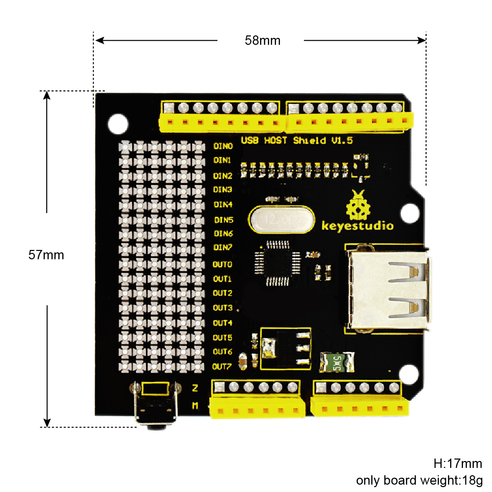
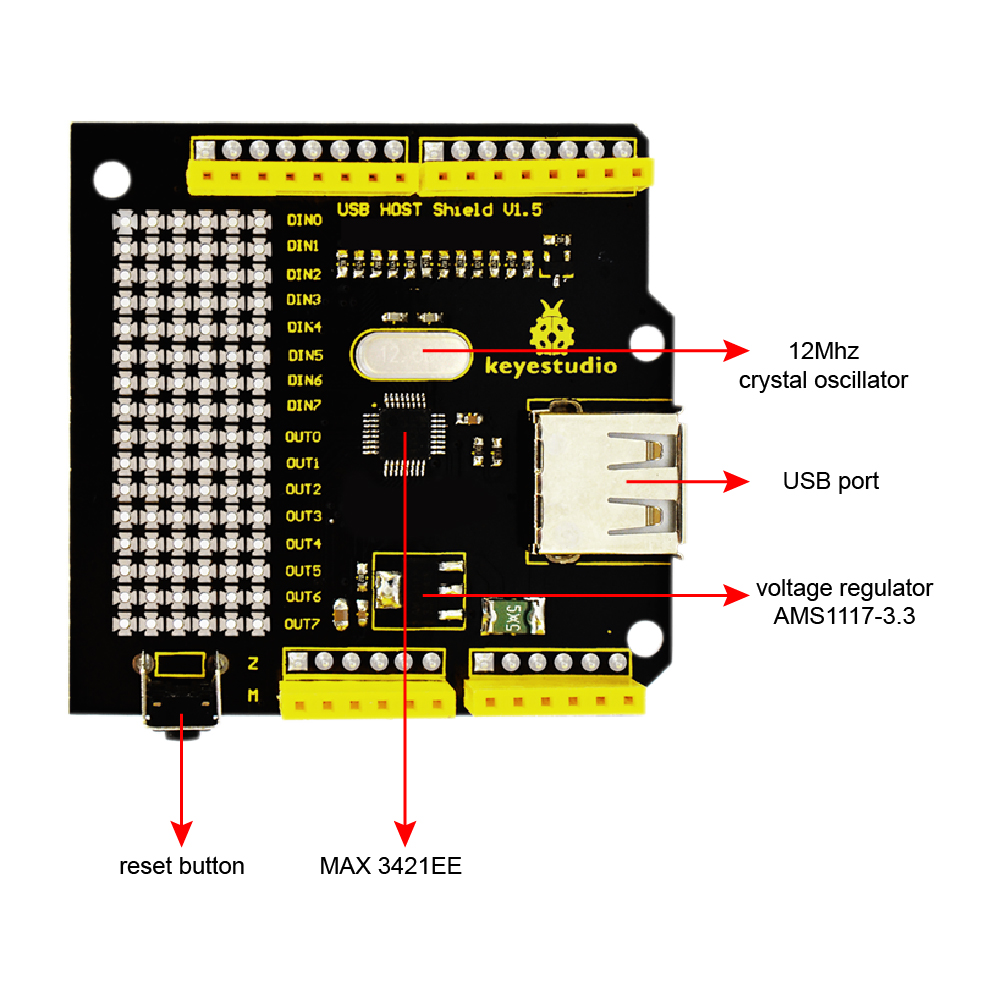
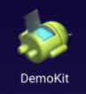
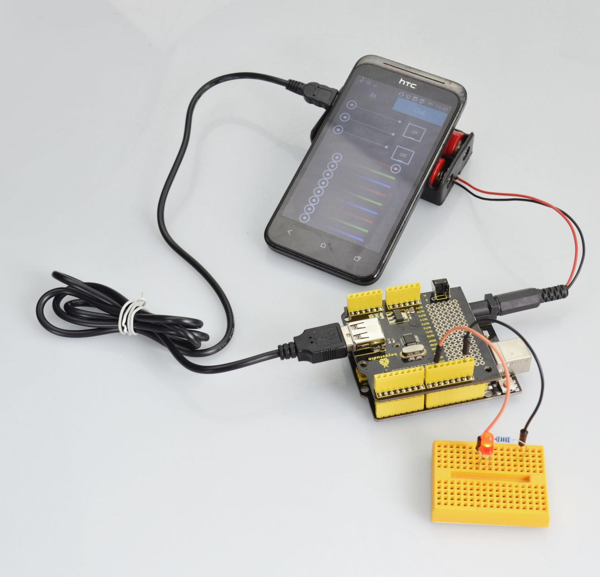
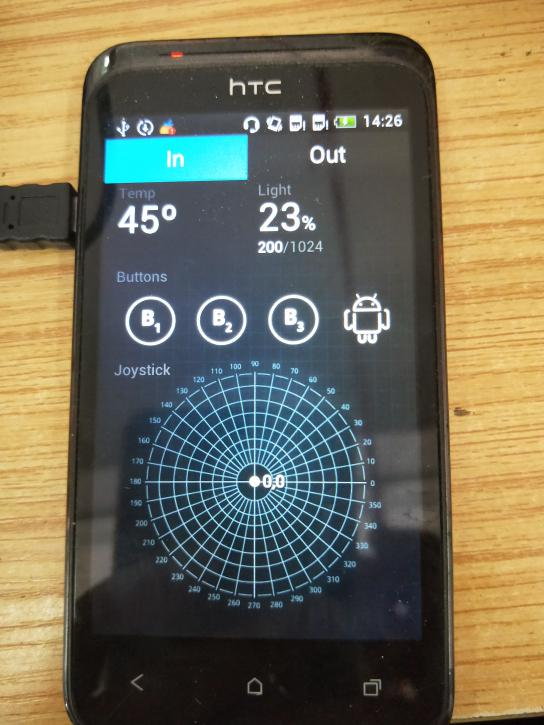

#  **KS0155 Keyestudio USB Host Shield V1.5**

**Introduction:**

keyestudio USB Host shield V1.5 is an add-on board for Arduino USB Host.
Directly plug it to Arduino board and it will allow Arduino to have USB Host
function. Arduino with host function can communicate with USB devices, such as
USB flash disk, keyboards, mouse, joysticks, digital cameras.

Among these functions, the most attractive one is supporting the connection of
android phones to realize Google ADK function.

It enables your phone as a control terminal to control your robot or other
devices. Meanwhile, it can display the collected data on your mobile terminal.

**Features:**

-   Supporting the Google Android ADK function

-   Compatible with UNO R3 and Mega control board.

-   Supporting the Android system, provided with
    [APP](https://drive.google.com/open?id=14-jybsiV2DvRa3cxdCdfRdHZWf9HoN-7)
    test ( at most Android 4.0.3 version)

-   Comes with a reset button

-   Realizing the USB Host function, enable to communicate with other USB
    devices and support the USB HUB function.

-   Onbaord comes with double-sided through-hole pad, welding the electronic
    elements and setting the prototype circuit.

**Technical Details:**

-   Dimensions: 58mm x 57mm x 17mm

-   Weight: 18g

****

**PINOUT:**

****

**Test Code:**

Below is an example code.

[Click here](https://drive.google.com/open?id=1ARXS7q2lhEiykEva24em_GLnkHdzrxl5)
to download the libraries.

[Click here](https://drive.google.com/open?id=18tH6hN7nRiHDJhyvDp0uGLGBJ0GqvmDB)
to download the code

Or you can directly copy and paste the code below to [Arduino
IDE](http://wiki.keyestudio.com/index.php/How_to_Download_Arduino_IDE).

\*\*\*\*\*\*\*\*\*\*\*\*\*\*\*\*\*\*\*\*\*\*\*\*\*\*\*\*\*\*\*\*\*\*\*\*\*\*\*\*\*\*\*\*\*\*\*\*\*\*\*\*\*\*\*\*\*\*\*\*\*\*\*\*\*

\#include \<Max3421e.h\>

\#include \<Usb.h\>

\#include \<AndroidAccessory.h\>

\#define LED 9

AndroidAccessory acc("Google, Inc.",

"DemoKit",

"DemoKit Arduino Board",

"1.0",

"http://www.android.com",

"0000000012345678");

void setup()

{

Serial.begin(115200);

Serial.print("\\r\\nStart");

acc.powerOn();

pinMode(LED, OUTPUT);

digitalWrite(LED, 0);

}

void loop()

{

byte msg[3];

if (acc.isConnected()) {

Serial.print("Accessory connected. ");

int len = acc.read(msg, sizeof(msg), 1);

Serial.print("Message length: ");

Serial.println(len, DEC);

if (len \> 0) {

// assumes only one command per packet

if (msg[0] == 0x2) {

if (msg[1] == 0x0)

analogWrite(LED, msg[2]);

}

}

}

delay(100);

}

\*\*\*\*\*\*\*\*\*\*\*\*\*\*\*\*\*\*\*\*\*\*\*\*\*\*\*\*\*\*\*\*\*\*\*\*\*\*\*\*\*\*\*\*\*\*\*\*\*\*\*\*\*\*\*\*\*\*\*\*\*\*\*\*\*

**Code to Note:**

1.Before compile the code, do remember to add the necessary libraries inside the
libraries directory of Arduino IDE.

Download the libraries from below link:

<https://drive.google.com/open?id=1ARXS7q2lhEiykEva24em_GLnkHdzrxl5>

2.The test code is only compatible for lower Arduino 1.0 version IDE.

**Example Use**

Install the [DemoKit
APP](https://drive.google.com/open?id=14-jybsiV2DvRa3cxdCdfRdHZWf9HoN-7) on your
Android phone( at most Android 4.0.3 version).

Stack the shield onto UNO R3 board and upload the code, connect an external LED.
Then connect the shield to your phone using a micro USB cable.

Powered on, click the icon of DemoKit to enter the input interface, then click
Out to enter the output interface.

When slide the Led1, the display data will be changed in the range of 0-255. The
greater the value is, the brighter the external LED is.

Resource

<https://fs.keyestudio.com/KS0155>
