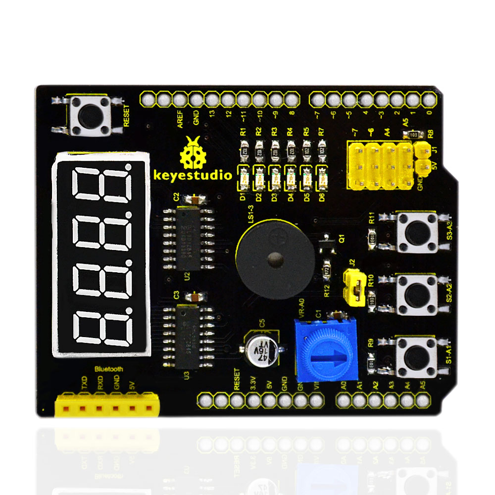
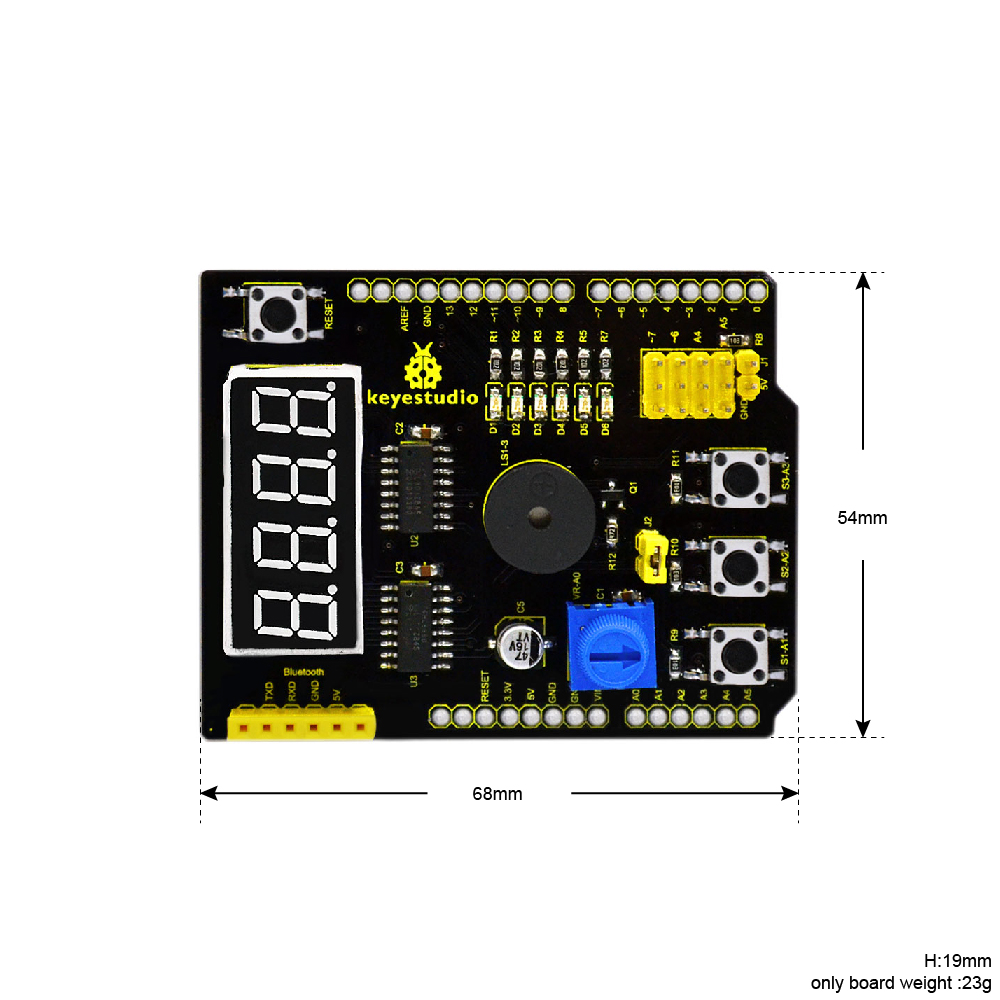
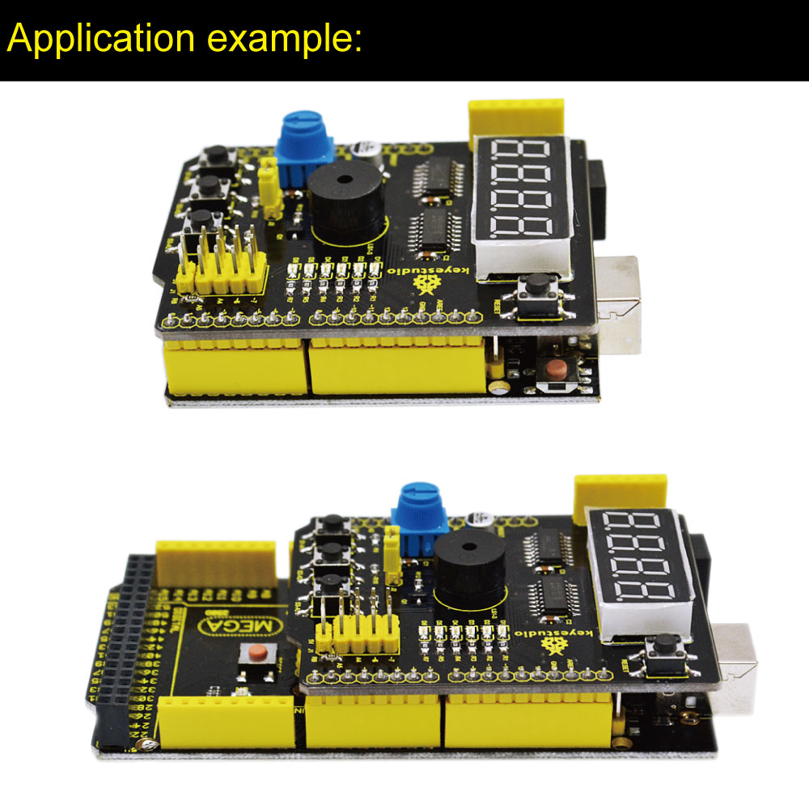
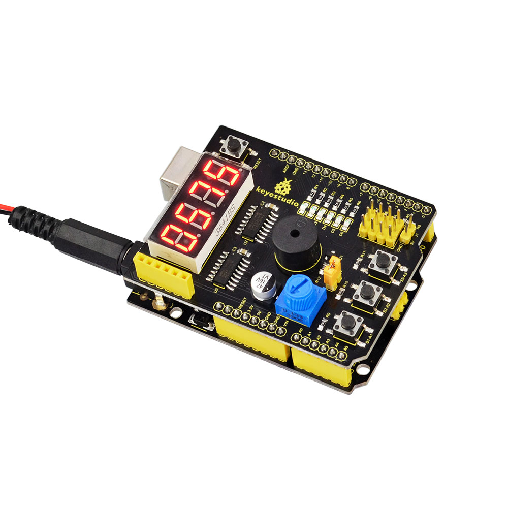

# **KS0184 keyestudio Multi-purpose Shield V2**

****

1.  **Description**

Multi-purpose Shield V2 is a learning board based on Arduino. No need for
soldering and connection. Download the program to complete experiment.

It is multi-purpose and we offer code libraries of all modules that have been
tested. You can use them directly.

There are extension ports on the shield to help you to complete other
experiments.

1.  **Features**

2.  Compatible with main controllers such as UNO R3 and MEGA.

3.  Comes with 6 LED indicators to show the program status.

4.  Comes with 3 switching buttons

5.  Comes with a reset button

6.  Comes with a potentiometer for analog input

7.  Comes with a passive buzzer for alarm.

8.  Comes with a 4-digit LED display to show the number

1.  **Details**

-   Dimensions: 68mm\*54mm\*19mm

-   Weight: 23g

1.  **Interface Instruction**

1.  **Hookup Guide**

Simply plug the shield into UNO R3 board or MEGA.

****

1.  **Upload the Code**

You can [click
here](https://drive.google.com/open?id=1LpUd7XiidAFPeu3ngrkiamJuY1H_0vKq) to
download the code or directly copy the code below to [Arduino
software](http://wiki.keyestudio.com/index.php/How_to_Download_Arduino_IDE).

\*\*\*\*\*\*\*\*\*\*\*\*\*\*\*\*\*\*\*\*\*\*\*\*\*\*\*\*\*\*\*\*\*\*\*\*\*\*\*\*\*\*\*\*\*\*\*\*\*\*\*\*\*\*\*\*\*\*\*\*\*\*\*\*\*\*\*\*\*\*\*\*\*\*\*\*\*\*\*\*\*\*\*\*\*\*\*

//pressing nothing to display value of analog revolving potentiometer

//pressing key1 to show 0-3 on LED Segment Displays

//pressing key2 and buzzer ringing

//pressing key3 and flowing light on

//defining three pins of 74HC595

int latchPin = 4;//ST_CP

int clockPin = 5;//SH_CP

int dataPin = 2; //DS

//defining three key input

int key1 = A1;

int key2 = A2;

int key3 = A3;

//buzzer pin

int buzzer = 3;

//pin definition of flowing light

int led1 = 13;

int led2 = 12;

int led3 = 11;

int led4 = 10;

int led5 = 9;

int led6 = 8;

int dat_wei[4]={0x01,0x02,0x04,0x08}; //LED Segment Displays

//showing 1--4

int dat_duan[10]={0xc0,0xf9,0xa4,0xb0,0x99,0x92,0x82,0xf8,0x80,0x90}; //LED
Segment Displays showing 0--9

char i=0;

void setup ()

{

pinMode(latchPin,OUTPUT);

pinMode(clockPin,OUTPUT);

pinMode(dataPin,OUTPUT);

pinMode(key1,INPUT);

pinMode(key2,INPUT);

pinMode(key3,INPUT);

pinMode(buzzer,OUTPUT);

pinMode(led1,OUTPUT);

pinMode(led2,OUTPUT);

pinMode(led3,OUTPUT);

pinMode(led4,OUTPUT);

pinMode(led5,OUTPUT);

pinMode(led6,OUTPUT);

for(char i=8;i\<14;i++)

digitalWrite(i,HIGH);

}

void loop()

{

if(digitalRead(key1)==LOW )

SMG(); //testing LED Segment Displays

if(digitalRead(key2)==LOW )

buzzer_(); //testing buzzer

if(digitalRead(key3)==LOW)

led_display(); //testing LED

if(digitalRead(key1)==HIGH & digitalRead(key2)==HIGH & digitalRead(key3)==HIGH)

analog(); //testing analog input

}

void SMG(void)

{

digitalWrite(latchPin,LOW); //clear LED Segment Displays

shiftOut(dataPin, clockPin, MSBFIRST ,0x00);

shiftOut(dataPin, clockPin, MSBFIRST ,0x00);

digitalWrite(latchPin,HIGH);

while(1)

{

digitalWrite(latchPin,LOW);

//MSBFIRST,transmitting binary bit from high to low,74HC595 starts from first
piece, and displaces data from Q0 to Q7. If there is data, it will start from
the second piece like this.

shiftOut(dataPin, clockPin, MSBFIRST ,dat_duan[i]); //data about second piece

shiftOut(dataPin, clockPin, MSBFIRST ,dat_wei[i]); //way of MSBFIRST,data about
first piece

digitalWrite(latchPin,HIGH);

i++;

if(i==4){i=0;}

if(digitalRead(key1)==HIGH)

{

digitalWrite(latchPin,LOW); //clear LED Segment Displays

shiftOut(dataPin, clockPin, MSBFIRST ,0x00);

shiftOut(dataPin, clockPin, MSBFIRST ,0x00);

digitalWrite(latchPin,HIGH);

break;

}

}

}

void buzzer_(void)

{

char i;

digitalWrite(latchPin,LOW); //clear LED Segment Displays

shiftOut(dataPin, clockPin, MSBFIRST ,0x00);

shiftOut(dataPin, clockPin, MSBFIRST ,0x00);

digitalWrite(latchPin,HIGH);

while(1)

{

for(i=0;i\<80;i++)// output a frequency sound

{

digitalWrite(buzzer,LOW);// sound

delay(1);//delay1ms

digitalWrite(buzzer,HIGH);//not sound

delay(1);//ms delay

}

for(i=0;i\<100;i++)// output a frequency sound

{

digitalWrite(buzzer,LOW);// sound

digitalWrite(buzzer,HIGH);//not sound

delay(2);//2ms delay

}

if(digitalRead(key2)==HIGH)

{

digitalWrite(latchPin,LOW); //clear LED Segment Displays

shiftOut(dataPin, clockPin, MSBFIRST ,0x00);

shiftOut(dataPin, clockPin, MSBFIRST ,0x00);

digitalWrite(latchPin,HIGH);

break;

}

}

}

void led_display()

{

digitalWrite(latchPin,LOW); //clear LED Segment Displays

shiftOut(dataPin, clockPin, MSBFIRST ,0x00);

shiftOut(dataPin, clockPin, MSBFIRST ,0x00);

digitalWrite(latchPin,HIGH);

while(1)

{

digitalWrite(led1,LOW);

delay(100);

digitalWrite(led1,HIGH);

digitalWrite(led2,LOW);

delay(100);

digitalWrite(led2,HIGH);

digitalWrite(led3,LOW);

delay(100);

digitalWrite(led3,HIGH);

digitalWrite(led4,LOW);

delay(100);

digitalWrite(led4,HIGH);

digitalWrite(led5,LOW);

delay(100);

digitalWrite(led5,HIGH);

digitalWrite(led6,LOW);

delay(100);

digitalWrite(led6,HIGH);

if(digitalRead(key3)==HIGH)

{

break;

}

}

}

void analog()

{

int val,qian,bai,shi,ge;

val=analogRead(A0);

qian=val/1000;

bai=val%1000;

bai=bai/100;

shi=val%100;

shi=shi/10;

ge=val%10;

digitalWrite(latchPin,LOW);

shiftOut(dataPin, clockPin, MSBFIRST ,dat_duan[qian]);

shiftOut(dataPin, clockPin, MSBFIRST ,0x01);

digitalWrite(latchPin,HIGH);

digitalWrite(latchPin,LOW);

shiftOut(dataPin, clockPin, MSBFIRST ,dat_duan[bai]);

shiftOut(dataPin, clockPin, MSBFIRST ,0x02);

digitalWrite(latchPin,HIGH);

digitalWrite(latchPin,LOW);

shiftOut(dataPin, clockPin, MSBFIRST ,dat_duan[shi]);

shiftOut(dataPin, clockPin, MSBFIRST ,0x04);

digitalWrite(latchPin,HIGH);

digitalWrite(latchPin,LOW);

shiftOut(dataPin, clockPin, MSBFIRST ,dat_duan[ge]);

shiftOut(dataPin, clockPin, MSBFIRST ,0x08);

digitalWrite(latchPin,HIGH);

}

\*\*\*\*\*\*\*\*\*\*\*\*\*\*\*\*\*\*\*\*\*\*\*\*\*\*\*\*\*\*\*\*\*\*\*\*\*\*\*\*\*\*\*\*\*\*\*\*\*\*\*\*\*\*\*\*\*\*\*\*\*\*\*\*\*\*\*\*\*\*\*\*\*\*\*\*\*\*\*\*\*\*\*\*\*\*\*

1.  **Test Result**

Done uploading the code to the board, power on the board, you should see the
4-digit LED display the number. Shown below.

The analog value output by potentiometer is showed on the 4-digit LED display.
Press the button S3-A3, the 6 SMD LEDs will light up one by one like the flowing
light, but 4-digit LED display is off.

Press the button S2-A2, the passive buzzer will beep and 4-digit LED display is
still off.

Press the button S1-A1, 4-digit LED display will show the default number 0123.

Resource:

<https://fs.keyestudio.com/KS0184>
