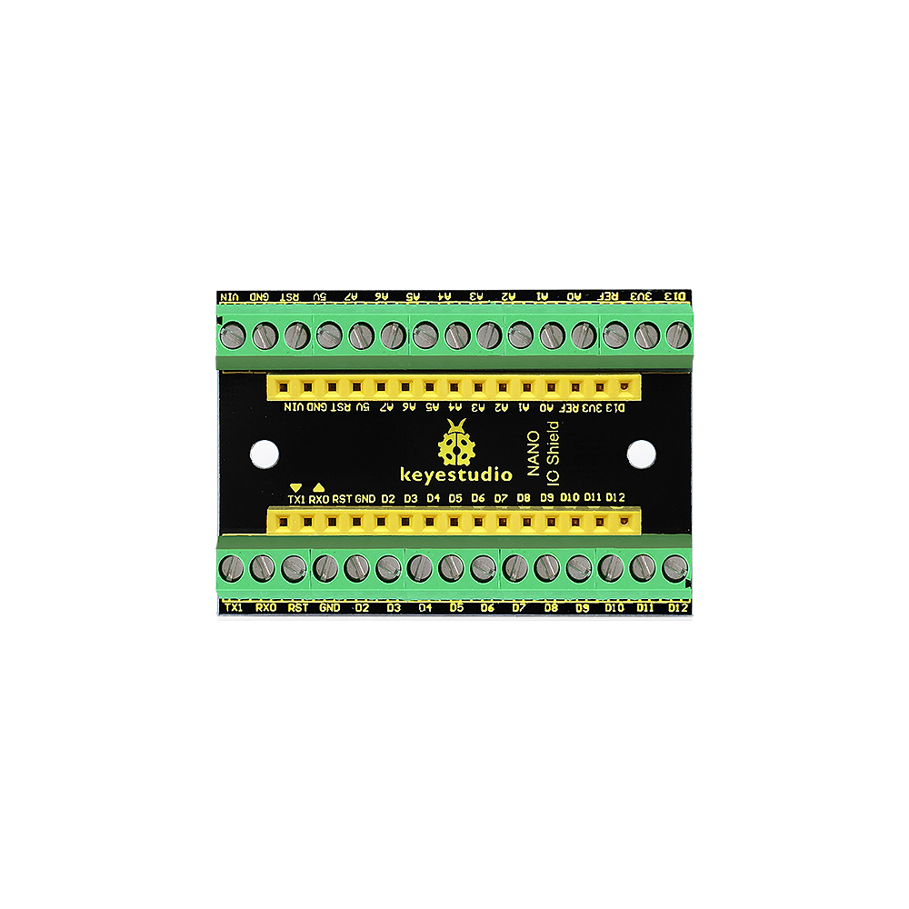
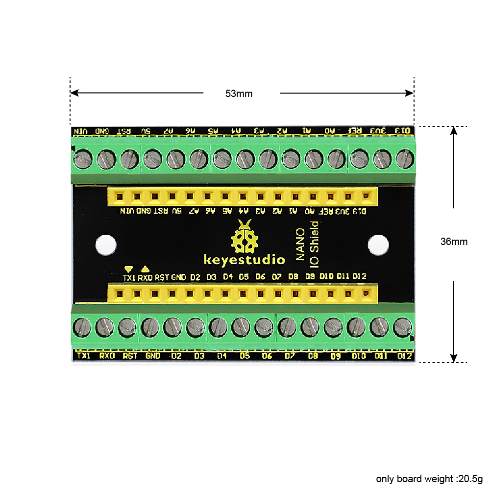
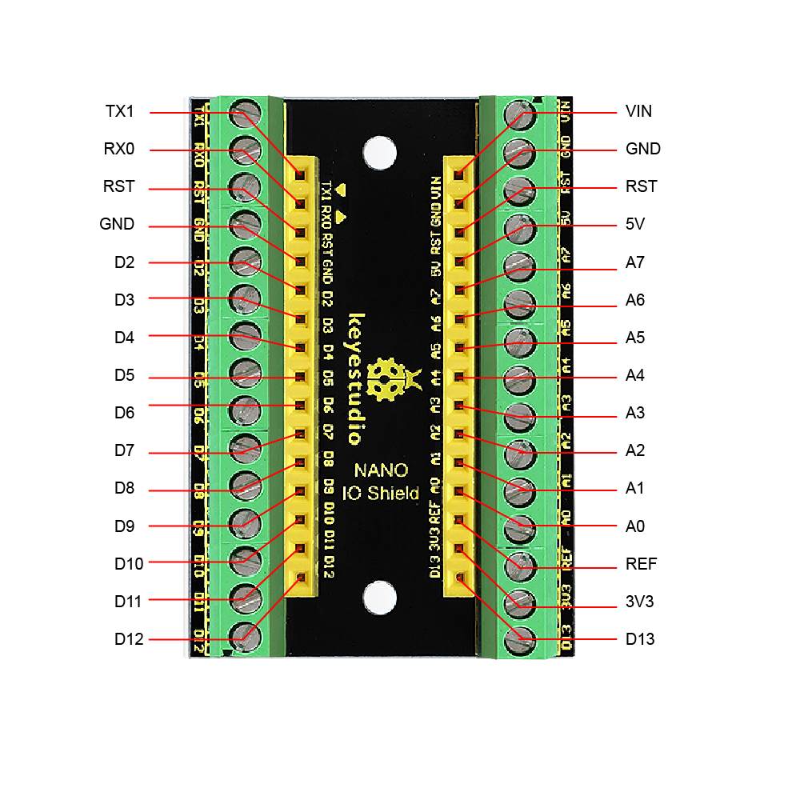
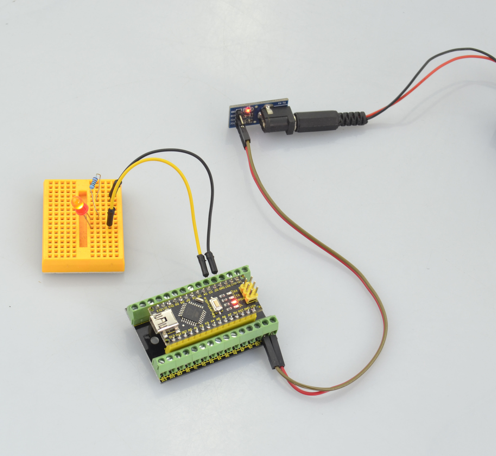

# **KS0250 Keyestudio NANO IO Shield**

**Introduction:**

This is a simple and small NANO IO shield. It breaks out all the pins of
keyestudio Nano ch340, easy to hook it up to make experiments. Onboard comes
with two 3mm fixed holes, convenient to fix the shield on other objects.

**Parameters:**

-   Terminal block spacing: 3.5mm

-   Female header pitch: 2.54mm

**Controller Compatible:**

-   [keyestudio Nano
    ch340](http://wiki.keyestudio.com/index.php/Ks0173_keyestudio_Nano_ch340)

**Technical Details:**

-   Dimensions: 53mm x 36mm

-   Weight: 20.5g

**PINOUT:**

Those interfaces marked in red line are connected.

**Example Use:**

Stack the NANO CH340 onto the shield, and upload well the code, you could power
the Nano ch340 via VIN GND interface to light up an external LED.

