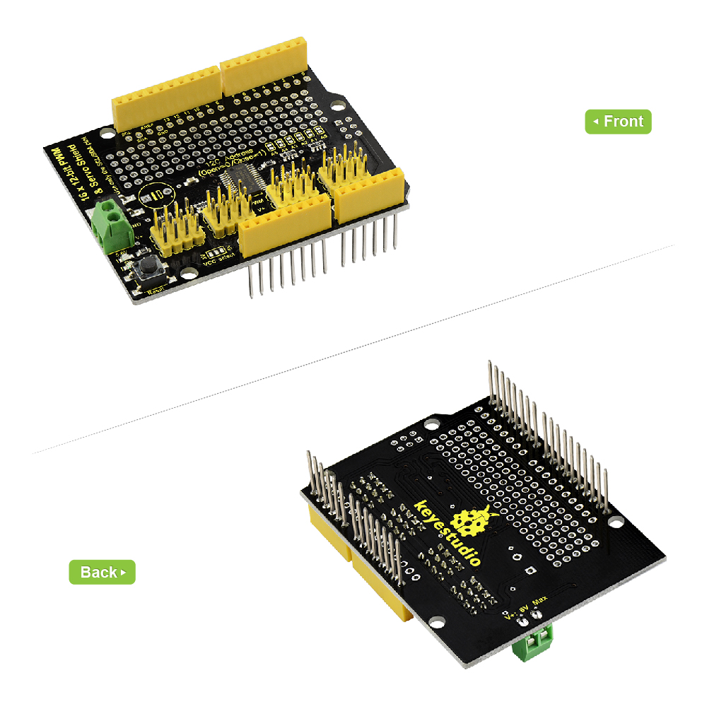

# **KS0258 Keyestudio 16-channel Servo Motor Drive Shield**

**(Black and Environmental-friendly)**

****

**Introduction**

When doing robot experiments, we needs to use multiple PWM ports to drive the
servo motor. However, the commonly-used Arduino UNO R3 only has 6 PWM ports,
which cannot meet the requirements. Thus this expansion board comes into use,
which is directly stacked on the Arduino UNO R3 board. It can drive up to16
servos and use I2C input, occupying A4 and A5 pins of UNO.

The shield also comes with PCB double-sided holes, which can be used to solder
with components to build up prototyping circuits.

**Performance Parameters**

-   I2C input, controlling 16-channel PWM output

-   Servo power independent input V+ , up to 6V.

-   Logic signal and logic power independent output 3-5V

-   Frequency: 40-1000Hz

-   Channel: 16-channel

-   Resolution: 12-bit

**Details:**

-   Dimensions: 69mm x 54mm x 24mm

-   Weight: 20g

    

**Interface Explanation:**

****

**Simple Hookup**

Simply stack the shield onto UNO R3 board.

**Sample Code**

Copy and paste the code below to [Arduino
IDE](http://wiki.keyestudio.com/index.php/How_to_Download_Arduino_IDE)

Or [click
here](https://drive.google.com/open?id=1YDzJsMsh73CfSdYTp9wnSdedQanG6fzj) to
download the code

[Click here](https://drive.google.com/open?id=1uSpbRoHXHS3WPgWmKU0ex4NOjDMh0Z5j)
to download the libraries *Adafruit_PWMServoDriver.h*

\*\*\*\*\*\*\*\*\*\*\*\*\*\*\*\*\*\*\*\*\*\*\*\*\*\*\*\*\*\*\*\*\*\*\*\*\*\*\*\*\*\*\*\*\*\*\*\*\*\*\*\*\*\*\*\*\*\*\*\*\*\*\*

This is an example for our keyestudio 16-channel PWM & Servo driver

PWM test - this will drive 16 PWMs in a 'wave'

These displays use I2C to communicate, 2 pins are required to

interface. For Arduino UNOs, thats SCL -\> Analog 5, SDA -\> Analog 4

keyestudio invests time and resources providing this open source code,

please support keyestudio and open-source hardware by purchasing

products from keyestudio !

\*\*\*\*\*\*\*\*\*\*\*\*\*\*\*\*\*\*\*\*\*\*\*\*\*\*\*\*\*\*\*\*\*\*\*\*\*\*\*\*\*\*\*\*\*\*\*\*\*\*\*\*\*\*\*\*\*\*\*\*\*\*\*

\#include \<Wire.h\>

\#include \<Adafruit_PWMServoDriver.h\>

// called this way, it uses the default address 0x40

Adafruit_PWMServoDriver pwm = Adafruit_PWMServoDriver();

// you can also call it with a different address you want

//Adafruit_PWMServoDriver pwm = Adafruit_PWMServoDriver(0x41);

void setup() {

Serial.begin(9600);

Serial.println("16 channel PWM test!");

// if you want to really speed stuff up, you can go into 'fast 400khz I2C' mode

// some i2c devices dont like this so much so if you're sharing the bus, watch

// out for this!

pwm.begin();

pwm.setPWMFreq(1600); // This is the maximum PWM frequency

// save I2C bitrate

uint8_t twbrbackup = TWBR;

// must be changed after calling Wire.begin() (inside pwm.begin())

TWBR = 12; // upgrade to 400KHz!

}

void loop() {

// Drive each PWM in a 'wave'

for (uint16_t i=0; i\<4096; i += 8) {

for (uint8_t pwmnum=0; pwmnum \< 16; pwmnum++) {

pwm.setPWM(pwmnum, 0, (i + (4096/16)\*pwmnum) % 4096 );

}

}

}

\*\*\*\*\*\*\*\*\*\*\*\*\*\*\*\*\*\*\*\*\*\*\*\*\*\*\*\*\*\*\*\*\*\*\*\*\*\*\*\*\*\*\*\*\*\*\*\*\*\*\*\*\*\*\*\*\*\*\*\*\*\*\*

Note: Before compiling the code above, do remember to add the libraries inside
the libraries folder of Arduino IDE.

**Test Result**

Upload the above code to UNO R3 and then connect 16 servo motors like the
pictures shown below. Finally, you should see 16 servos rotate successively.

**Resource Links**

<https://fs.keyestudio.com/KS0258>
