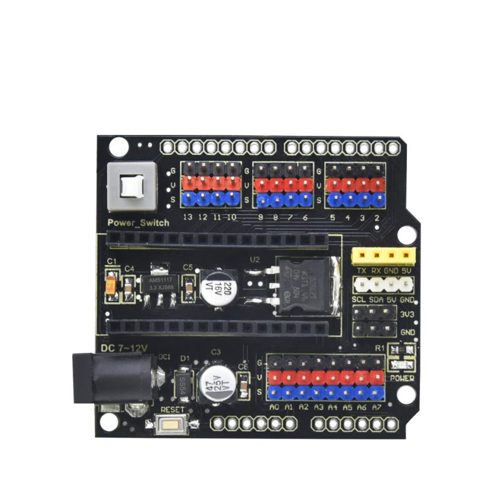

# **KS0485 Keyestudio NANO Shield With DC Head** 

**Description**

We particularly design this shield to make up the drawback of connecting sensors
or shields to keyestudio NANO control board.

This keyestudio NANO shield has extended the digital and analog ports as 3PIN
interface (G-GND V-5V S-digital port/analog port). It also adds some
communication pins/female headers of 2.54mm pitch, like I2C and serial
communication.

Additionally, the power is supplied from Power_Switch, a self-locking switch, to
NANO shield after inputting DC 7-12V to DC head.

With external power input, the keyestudio NANO shield provides power to NANO
control board on the one hand; it stably outputs 5V (output current 1.5A) to
power the external sensor / module by voltage regulator chip L7805 on the other
hand. At last, 5V can transfer into 3.3V via AMS1117-3.3V chip, and the function
of the chip can be expanded through pins.

The shield comes with a reset button and 1 signal indicators as well.

Two rows of 2.54mm pad holes reserved on the side can be used to extend all
external interfaces of the NANO control board out.

The 4 MS fixing holes make mount the shield on other devices easier.

**Parameters**

-   External input voltage: DC 7-12V

-   Output current: 1.5A

-   Maximum power: 7W

-   Working temperature: -20 ℃ --60 ℃

-   Size: 57.3 \* 53.5mm

-   Pin Header / Female Header Pitch: 2.54mm

-   Direct fixing hole: 3mm

-   Environmental attributes: ROHS

 
